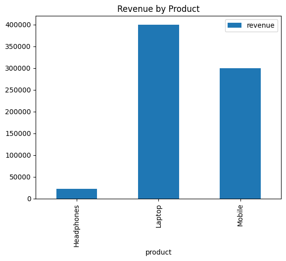

# Sales Summary Analysis using SQLite and Python

## Objective

The purpose of this project is to demonstrate how SQL can be used within Python to analyze sales data stored in a SQLite database. The project calculates total quantities sold and total revenue for each product and presents the results through tabular output and a simple bar chart.

## Dataset

A custom SQLite database named **sales_data.db** was created for this project. The database contains a single table called **sales** with the following fields:

* Product
* Quantity
* Price

Sample sales records were inserted into the table for analysis.

## Tools Used

* Python
* SQLite (sqlite3)
* Pandas
* Matplotlib

## Project Features

* Creates and connects to a SQLite database.
* Stores sample sales data in a sales table.
* Executes SQL queries to summarize sales performance.
* Calculates total quantity sold and total revenue by product.
* Imports SQL query results into a Pandas DataFrame.
* Displays summarized results using Python print statements.
* Visualizes revenue data using a Matplotlib bar chart.
* Saves the generated chart as an image file.

## Key Insights

* Laptops generated the highest revenue among all products.
* Mobile phones recorded strong sales performance with substantial revenue.
* Headphones had the lowest revenue despite a relatively high quantity sold.
* Revenue analysis helps identify the most profitable products.

## Outcome

This project provided hands-on experience with SQLite database management, SQL query execution, data extraction using Pandas, and basic data visualization using Matplotlib. It demonstrates how Python and SQL can be combined to perform simple business and sales analytics tasks.

---

## Dashboard

```markdown

```

---

## Files Included

* Main Python Script (`sales_analysis.py`)
* SQLite Database (`sales_data.db`)
* Sales Chart (`sales_chart.png`)
* README File (`README.md`)
